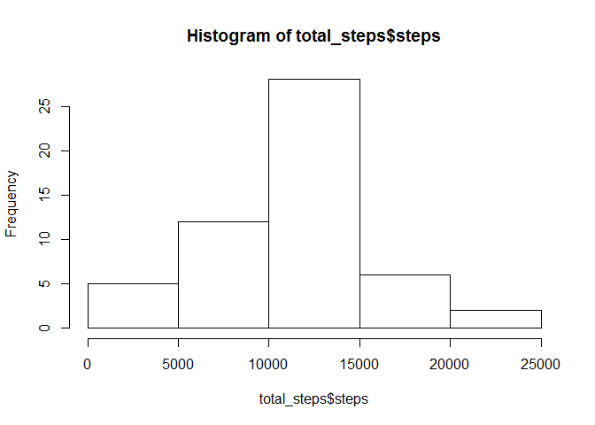
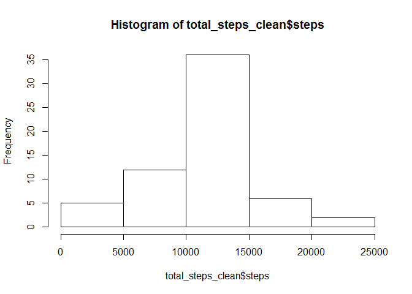
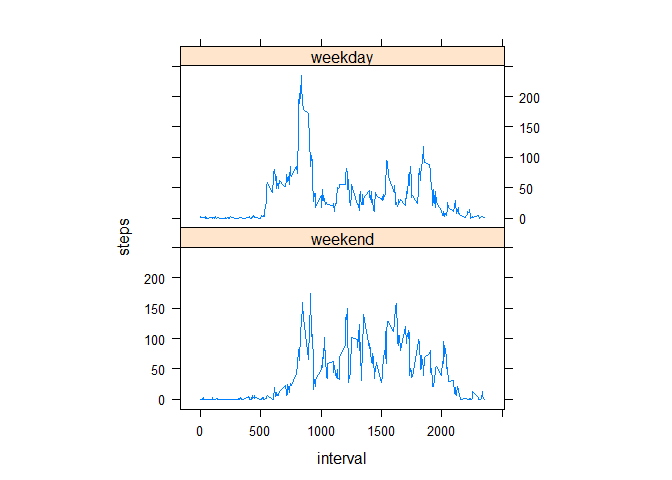

# Reproducible Research: Peer Assessment 1


## Loading and preprocessing the data
Fork <https://github.com/rdpeng/RepData_PeerAssessment1> Repository  
Clone repository to a local repository  
Set working directory to the local repository  
Load data  

```r
unzip(zipfile="activity.zip")
raw <- read.csv("activity.csv", na.strings="NA", colClasses=c("integer","Date","integer"))
data <- raw[!is.na(raw$steps), ]
```
Create figures directory  

```r
if (file.exists("figures")){ } else {dir.create("figures")}
```

## What is mean total number of steps taken per day?
1. Histogram of the total number of steps taken each day  
Save a png of the histogram to the figures directory  

```r
total_steps <- aggregate(steps ~ date, data = data, sum, na.rm = T)
png("figures/01_histogram.png", width = 480, height = 480)
hist(total_steps$steps)
dev.off()
```

```r
hist(total_steps$steps)
```

 
  
2. **Mean** and **Median** of the total number of steps per day  
The **Mean** of the total number of steps per day is 10766.  
The **Median** of the total number of steps per day is 10765.  
Note: I fixed the scientific format for the mean value by making scientific = F in the format function  

```r
format(mean(total_steps$steps), scientific = F)
```

## What is the average daily activity pattern?
1. Time series plot of the 5-minute interval (x-axis) and the average number of steps taken, averaged across all days (y-axis)  

```r
interval_steps <- aggregate(steps ~ interval, data = data, mean, na.rm = T)
png("figures/02_seriesplot.png", width = 480, height = 480)
plot(steps ~ interval, data = interval_steps, type = "l")
dev.off()
```

```r
plot(steps ~ interval, data = interval_steps, type = "l")
```

 

2. Which 5-minute interval, on average across all the days in the dataset, contains the maximum number of steps?  
The maxium number of steps on average across all the days in the dataset is 835  

```r
interval_steps[which.max(interval_steps$steps), ] [[1]]
```

## Imputing missing values
1. Calculate and report the total number of missing values in the dataset (i.e. the total number of rows with NAs)  
There are  2304 missing values.

```r
sum(is.na(raw$steps))
```

2. Devise a strategy for filling in all of the missing values in the dataset. The strategy does not need to be sophisticated. For example, you could use the mean/median for that day, or the mean for that 5-minute interval, etc.  

Create a clean dataset that replaces the "NA" values with the mean for that 5-minute interval.


3. Create a new dataset that is equal to the original dataset but with the missing data filled in.  


```r
clean <- raw
for (i in 1:nrow(clean)){
    if (is.na(clean[i, ]$steps)) {
        clean[i,]$steps <- interval_steps[interval_steps$interval == clean[i,]$interval,]$steps
    }
}
```

4. Make a histogram of the total number of steps taken each day and Calculate and report the mean and median total number of steps taken per day. Do these values differ from the estimates from the first part of the assignment? What is the impact of imputing missing data on the estimates of the total daily number of steps?  


```r
total_steps_clean <- aggregate(steps ~ date, data = clean, sum, na.rm = T)
png("figures/03_histogram.png", width = 480, height = 480)
hist(total_steps_clean$steps)
dev.off()
```

```r
hist(total_steps_clean$steps)
```

 

The **Mean** of the total number of steps per day is 10766 compared to 10766.  
The **Median** of the total number of steps per day is 10766 compared to 10765.  

There is little difference between excluding the NAs and entering averages for each interval.

## Are there differences in activity patterns between weekdays and weekends?

Create a new factor variable in the dataset with two levels – “weekday” and “weekend” indicating whether a given date is a weekday or weekend day.  

Created a day and weekday column for the data dataset  

```r
data$day <- weekdays(data$date)
for (i in 1:nrow(data)){
    if(data[i,4] %in% c("Saturday", "Sunday"))
        {data$weekday[[i]] <- "weekend"}
            else {data$weekday[[i]] <- "weekday"}
}
data$weekday <- factor(data$weekday, levels = c("weekend", "weekday"))
```

Make a panel plot containing a time series plot (i.e. type = "l") of the 5-minute interval (x-axis) and the average number of steps taken, averaged across all weekday days or weekend days (y-axis). The plot should look something like the following, which was creating using simulated data:  

```r
require(lattice)
```

```
## Loading required package: lattice
```

```r
interval_stepsday <- aggregate(steps ~ interval + weekday, data, mean)
png("figures/04_panelplot.png", width = 480, height = 480)
xyplot(steps ~ interval | factor(weekday), data = interval_stepsday, aspect = 1/2, type = "l")
dev.off()
```

```r
xyplot(steps ~ interval | factor(weekday), data = interval_stepsday, aspect = 1/2, type = "l")
```

 
